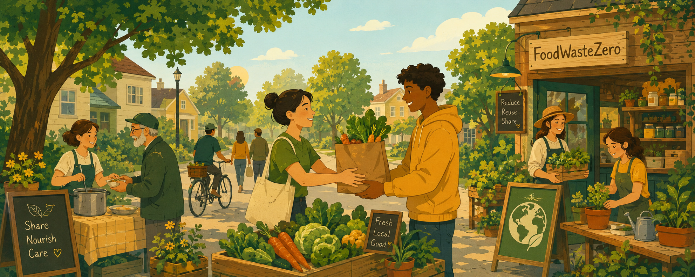

<div align="center">
  

  # FoodWasteZero 🌱

  **Poveži tiste, ki imajo hrano – s tistimi, ki jo potrebujejo.**

  [](https://flutter.dev)
  [](https://firebase.google.com)
  [](LICENSE)
  [](../../pulls)
  [](../../actions)

  [⬇️ Prenesi APK](https://github.com/FoodWasteZero/FoodWasteZero/actions/runs/26882968684/artifacts/7383949409) · [🐛 Prijavi napako](../../issues) · [🤝 Prispevaj](#prispevanje)

</div>

---

## Kaj je FoodWasteZero?

FoodWasteZero je odprtokodna mobilna aplikacija, ki pomaga zmanjšati količino zavržene hrane. Restavracije, pekarne in posamezniki objavijo presežno hrano — drugi jo prevzamejo brezplačno ali po simbolični ceni, preden konča v smeteh.

Vsako leto se zavrže **tretjina vse hrane na svetu**. FoodWasteZero je naš odgovor na ta problem.

---

## Funkcionalnosti

- 📍 **Oglasi v bližini** — ponudbe hrane glede na tvojo lokacijo in nastavljeni radij
- 🔔 **Obvestila v realnem času** — takoj izvedi, ko se pojavi nova ponudba
- 📦 **Rezervacija in prevzem** — rezerviraj, prejmi QR kodo, prevzemi brez čakanja
- 🌙 **Temni način** — preklopljiv v nastavitvah, shranjen med sejami
- 👤 **Profil in sledenje** — sledi objavljavcem, pregleduj zgodovino prevzemov
- 🗺️ **Zemljevid** — vizualni pregled vseh aktivnih oglasov v okolici
- 🍽️ **Recepti** — pametni predlogi za hrano, ki jo imaš doma

---

## Prenesi aplikacijo

**Android APK** — najnovejši build, direktno iz CI/CD:

👉 **[Prenesi FoodWasteZero.apk](https://github.com/FoodWasteZero/FoodWasteZero/actions/runs/26882968684/artifacts/7383949409)**

> Za namestitev omogoči **"Namestitev iz neznanih virov"** v Nastavitve → Varnost.

---

## Tech Stack

| Plast | Tehnologija |
|-------|-------------|
| Mobilna aplikacija | Flutter (Dart) |
| Backend & Auth | Firebase (Firestore, Auth, Storage) |
| Obvestila | Firebase Cloud Messaging |
| Zemljevid | Google Maps API |
| CI/CD | GitHub Actions |

---

## Namestitev za razvoj

### Predpogoji
- Flutter SDK 3.x
- Firebase CLI
- Android Studio ali VS Code

### Koraki

```bash
# 1. Kloniraj repozitorij
git clone https://github.com/FoodWasteZero/FoodWasteZero.git
cd FoodWasteZero

# 2. Namesti odvisnosti
flutter pub get

# 3. Nastavi Firebase
dart pub global activate flutterfire_cli
flutterfire configure

# 4. Dodaj .env datoteko
cp .env.example .env

# 5. Zaženi aplikacijo
flutter run
```

---

## Prispevanje

Prispevki so dobrodošli — od popravkov napak do novih funkcionalnosti.

```bash
# Ustvari vejo za svojo spremembo
git checkout -b feature/ime-funkcionalnosti

# Commitaj
git commit -m "feat: opis spremembe"

# Pošlji in odpri Pull Request
git push origin feature/ime-funkcionalnosti
```

Za večje spremembe najprej odpri [issue](../../issues) in opiši, kaj bi rad dodal.

---

## Prijava napak

Če si naletel na napako, najprej preveri [obstoječe issue-je](../../issues). Če napake še ni prijavljene, odpri novo — priloži čim več podrobnosti (naprava, verzija Androida, koraki za reprodukcijo).

Za varnostne ranljivosti nas kontaktiraj zasebno, ne prek javnih issue-jev.

---

<div align="center">
  <sub>© 2025 FoodWasteZero · Released under the MIT License</sub>
</div>
